## HireMind AI – Explainable Multi-Agent Hiring Copilot

## Overview

HireMind AI is an AI-powered recruitment intelligence system designed to assist HR teams in evaluating candidates efficiently, transparently, and consistently.

The system ingests a Job Description (JD) along with multiple candidate resumes (PDF/DOCX), performs semantic AI-based matching, evaluates candidates using a weighted rubric scoring system, generates explainable hiring insights, and produces a ranked shortlist dashboard.

Unlike traditional keyword-based ATS systems, HireMind AI combines:

* Semantic embeddings
* Explainable AI scoring
* Modular multi-agent architecture
* Human-in-the-loop decision making
* Local LLM reasoning

The goal of the system is not to replace recruiters, but to augment HR decision-making with faster and more explainable candidate analysis.

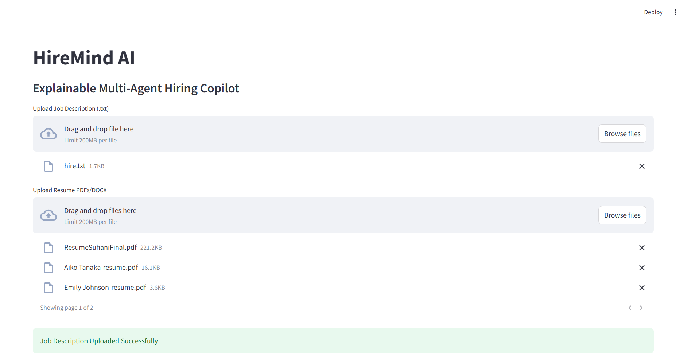

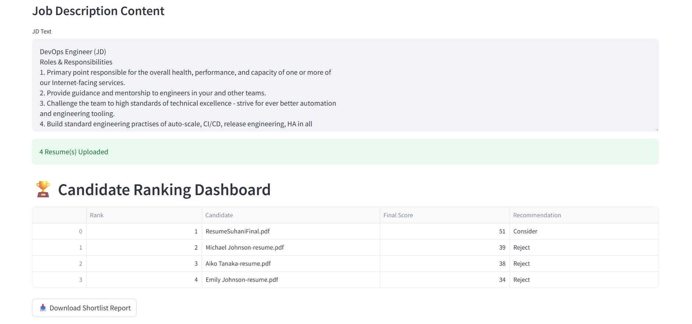

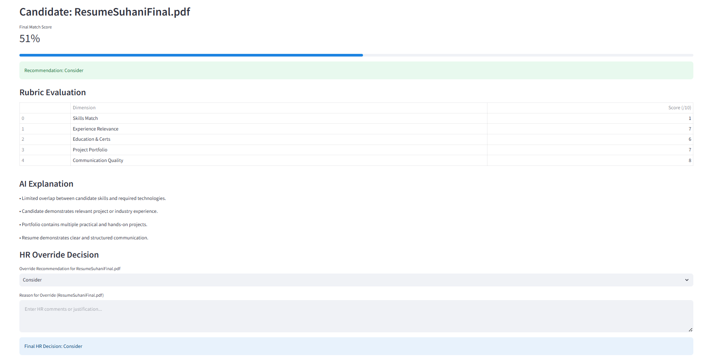

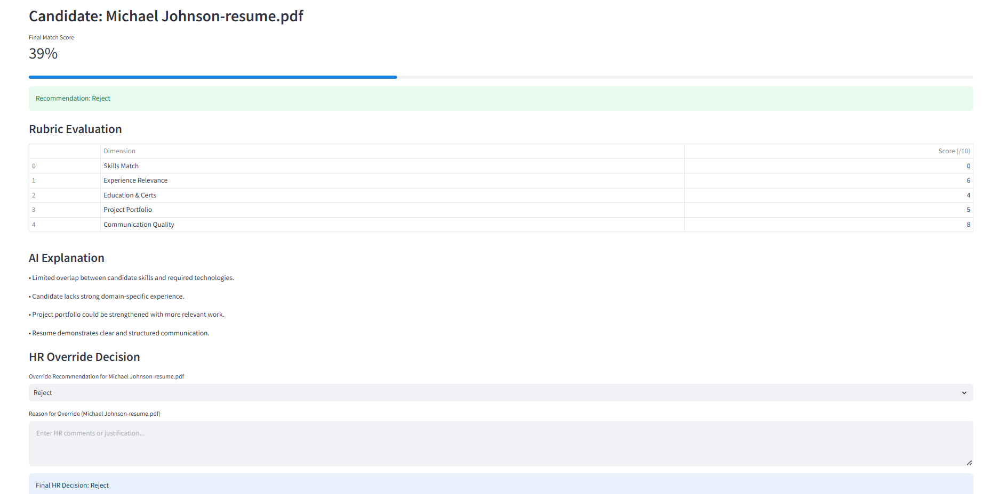

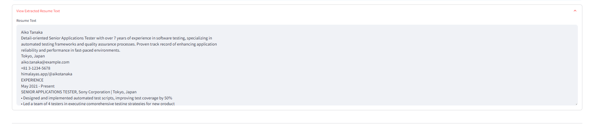

## Hybrid AI Architecture

HireMind AI follows a hybrid AI architecture that combines:

* Semantic AI using Sentence-Transformers embeddings
* Deterministic rule-based rubric scoring
* Local LLM reasoning using FLAN-T5
* Human-in-the-loop recruiter oversight

    Instead of relying entirely on a black-box LLM pipeline, the system integrates semantic search, explainable scoring logic, and lightweight local language models to improve transparency, reliability, and recruiter trust.

    This architecture reduces hallucination risk while maintaining explainability and semantic intelligence.

# Key Features

## 1. Resume Parsing Engine

* Supports PDF and DOCX resumes
* Extracts raw textual information using:

  * PyMuPDF
  * python-docx
* Handles multiple resumes simultaneously

---

## 2. Job Description Parsing

* Upload and analyze textual job descriptions
* Extracts hiring context for semantic comparison
* Used as the reference profile for candidate evaluation

---

## 3. Semantic Matching Engine

* Uses Sentence-Transformers embeddings
* Computes semantic similarity between:

  * Job Description
  * Candidate Resume
* Goes beyond simple keyword matching

Example:

* “ML” ≈ “Machine Learning”
* “JS” ≈ “JavaScript”
* “Frontend Engineer” ≈ “React Developer”

This improves candidate ranking quality significantly.

---

## 4. Weighted Rubric-Based Scoring

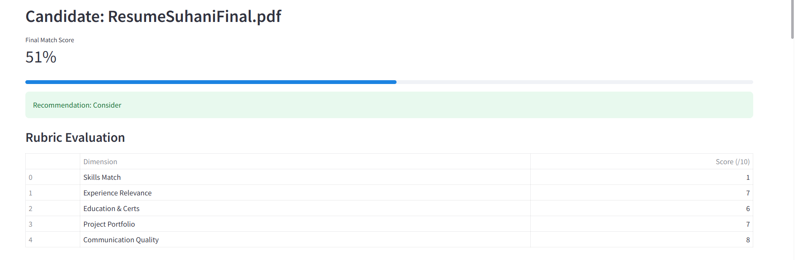

Each candidate is evaluated across 5 dimensions:

| Dimension                  | Weight |
| -------------------------- | ------ |
| Skills Match               | 30%    |
| Experience Relevance       | 25%    |
| Education & Certifications | 15%    |
| Project Portfolio          | 20%    |
| Communication Quality      | 10%    |

The system generates:

* Dimension-wise scores
* Weighted final score
* Hiring recommendation

Recommendations include:

* Strong Hire
* Hire
* Consider
* Reject

---

## 5. Explainable AI

HireMind AI provides transparent reasoning behind every recommendation.

Instead of black-box scoring, the system generates structured explanations such as:

* Strong technical alignment with required skills
* Relevant hands-on project experience
* Missing domain-specific technologies
* Communication quality observations

This increases recruiter trust and interpretability.

---

## 6. Candidate Ranking Dashboard

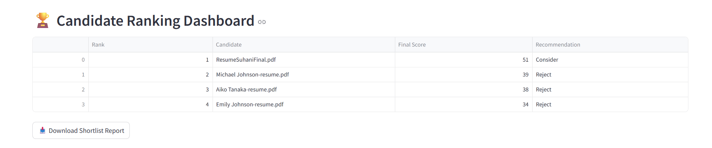

Candidates are automatically:

* Evaluated
* Ranked
* Sorted by weighted score

The Streamlit dashboard displays:

* Rank
* Candidate Name
* Final Score
* Recommendation

This enables recruiters to shortlist top candidates quickly.

---

## 7. Human-in-the-Loop HR Override

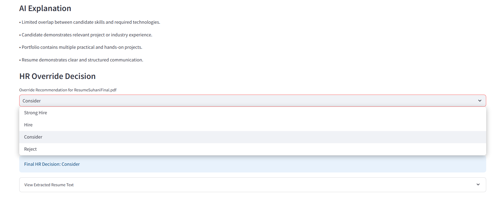

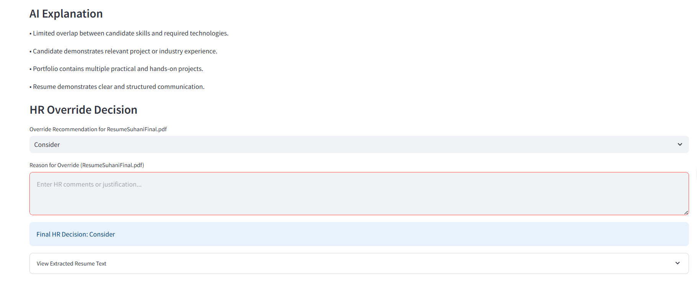

The system allows HR recruiters to:

* Override AI recommendations
* Add HR justification notes
* Maintain final human control over hiring decisions

This prevents over-reliance on automation.

---

## 8. CSV Shortlist Export

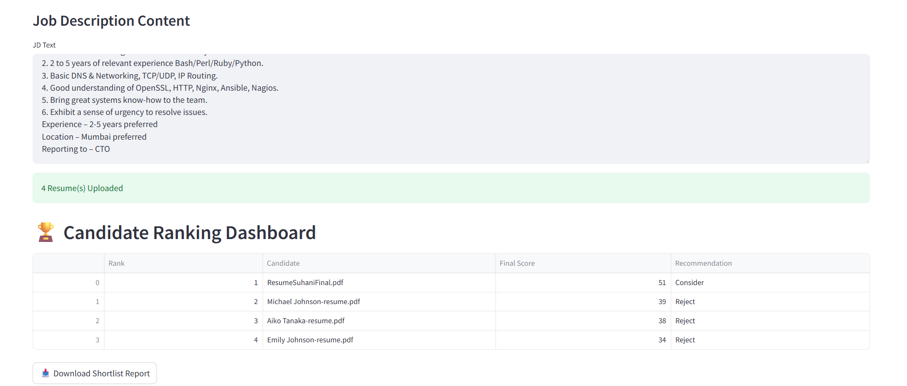

Recruiters can download:

* Ranked shortlist report
* Candidate evaluations
* Recommendation summaries

Export format:

* CSV

---

# System Architecture

## High-Level Workflow

# System Architecture Flow

```text
                ┌─────────────────────┐
                │  Job Description    │
                └─────────┬───────────┘
                          │
                          ▼
                ┌─────────────────────┐
                │   JD Parser Agent   │
                └─────────┬───────────┘
                          │
                          ▼
                ┌─────────────────────┐
                │ Structured JD Data  │
                └─────────┬───────────┘

────────────────────────────────────────────────

                ┌─────────────────────┐
                │  Resume Uploads     │
                └─────────┬───────────┘
                          │
                          ▼
                ┌─────────────────────┐
                │ Resume Parser Agent │
                └─────────┬───────────┘
                          │
                          ▼
                ┌─────────────────────┐
                │ Extracted Resume    │
                │      Content        │
                └─────────┬───────────┘

────────────────────────────────────────────────

                          ▼
                ┌─────────────────────┐
                │ Embedding Generator │
                │ SentenceTransformers│
                └─────────┬───────────┘
                          │
                          ▼
                ┌─────────────────────┐
                │ Semantic Matching   │
                │ Cosine Similarity   │
                └─────────┬───────────┘
                          │
                          ▼
                ┌─────────────────────┐
                │ Rubric Scoring Agent│
                └─────────┬───────────┘
                          │
                          ▼
                ┌─────────────────────┐
                │ Explainability Agent│
                │  + Local LLM Logic  │
                └─────────┬───────────┘
                          │
                          ▼
                ┌─────────────────────┐
                │ Candidate Ranking   │
                │      Dashboard      │
                └─────────┬───────────┘
                          │
                          ▼
                ┌─────────────────────┐
                │ HR Override System  │
                │ Human-in-the-Loop   │
                └─────────┬───────────┘
                          │
                          ▼
                ┌─────────────────────┐
                │ CSV Report Export   │
                └─────────────────────┘
```

# Multi-Agent Architecture

The system follows a modular multi-agent design.

## Agents Used

### 1. Resume Agent

Responsible for:

* Resume ingestion
* Resume text extraction
* File-type handling

---

### 2. Semantic Matching Agent

Responsible for:

* Embedding generation
* Similarity scoring
* Candidate-JD semantic comparison

---

### 3. Scoring Agent

Responsible for:

* Weighted rubric evaluation
* Dimension-wise scoring
* Final recommendation generation

---

### 4. Explainability Agent

Responsible for:

* Structured AI reasoning
* Candidate suitability explanation
* Interpretable recruiter insights

---

### 5. Ranking Agent

Responsible for:

* Candidate sorting
* Leaderboard generation
* Shortlist prioritization

---

# AI Models & Frameworks Used

## LLM Used

### FLAN-T5 (Local LLM)

Purpose:

* Lightweight reasoning
* AI explanation support
* Local inference

Reason for Selection:

* Free and lightweight
* Runs locally without paid APIs
* Faster experimentation
* Avoids API quota limitations
* Supports explainability workflows

---

## Embedding Model

### Sentence-Transformers (all-MiniLM-L6-v2)

Purpose:

* Semantic similarity matching
* Candidate ranking
* Embedding generation

Reason for Selection:

* Fast inference
* Lightweight model size
* Strong semantic search performance
* Excellent for resume-to-JD comparison

---

## Agent Framework

### LangChain

Purpose:

* Prompt orchestration
* Structured prompt templating
* Modular AI workflow design

Reason for Selection:

* Simplifies prompt engineering
* Encourages modular architecture
* Improves maintainability
* Widely adopted AI framework


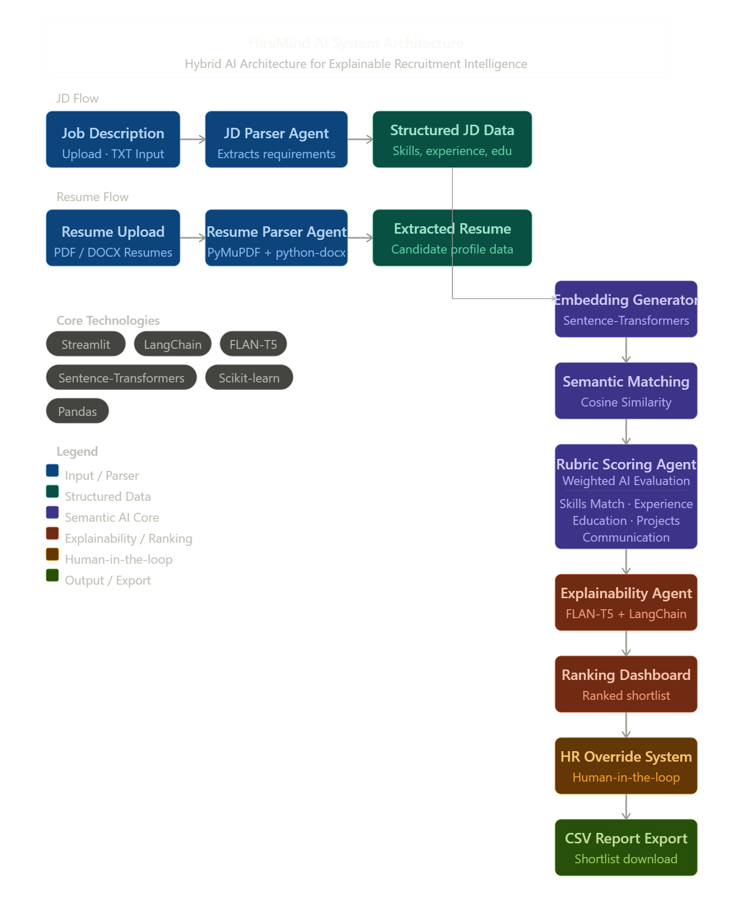

---

# Tech Stack

| Layer             | Technology               |
| ----------------- | ------------------------ |
| Frontend          | Streamlit                |
| Backend           | Python                   |
| Resume Parsing    | PyMuPDF, python-docx     |
| Embeddings        | Sentence-Transformers    |
| Similarity Search | Cosine Similarity        |
| AI Framework      | LangChain                |
| Local LLM         | FLAN-T5 |
| Data Processing   | Pandas                   |
| ML Utilities      | Scikit-learn             |
| Report Export     | CSV                      |

---

# Project Structure

```text
hiremind-ai/
│
├── app.py
│
├── agents/
│   ├── resume_agent.py
│   ├── scoring_agent.py
│   ├── explanation_agent.py
│   ├── langchain_agent.py
│
├── parsers/
│   ├── pdf_parser.py
│   ├── docx_parser.py
│
├── embeddings/
│   ├── semantic_matcher.py
│
├── uploads/
├── reports/
├── SECURITY.md
├── README.md
```

---

# Installation & Setup

## 1. Clone Repository

```bash
git clone <repository_link>
cd hiremind-ai
```

---

## 2. Create Virtual Environment

```bash
python -m venv venv
```

Activate:

### Windows

```bash
venv\Scripts\activate
```

### Linux / Mac

```bash
source venv/bin/activate
```

---

## 3. Install Dependencies

```bash
pip install -r requirements.txt
```

---

## 4. Run Streamlit App

```bash
streamlit run app.py
```

---

# Sample Workflow

## Step 1

Upload Job Description

---

## Step 2

Upload Multiple Resumes

---

## Step 3

AI System Performs:

* Resume parsing
* Semantic matching
* Rubric scoring
* Candidate ranking
* Explainability generation

---

## Step 4

HR Reviews:

* Scores
* Recommendations
* AI explanations
* Override options

---

## Step 5

Export Shortlist Report

---

# Security Risk Mitigation

## Prompt Injection Mitigation

* Structured rubric scoring reduces uncontrolled LLM behavior
* Prompt templates controlled using LangChain
* Deterministic scoring minimizes manipulation

---

## Data Privacy Protection

* Resume processing performed locally
* No external storage/database used
* Uploaded resumes processed temporarily

---

## API Key Protection

* Sensitive credentials stored in `.env`
* No hardcoded secrets
* `.env` excluded from Git tracking

---

## Hallucination Risk Reduction

* Rule-based scoring used for critical evaluation
* Human HR override enabled
* Explainability tied directly to rubric dimensions

---

## Human Oversight

* AI recommendations are assistive only
* Final hiring decision remains with HR

---

# Challenges Faced

During development, several engineering challenges were encountered:

* LLM API quota limitations
* Dependency/version conflicts
* Resume parsing inconsistencies
* Local model optimization
* Explainability reliability

These were addressed by:

* Moving to local LLM inference
* Using lightweight embedding models
* Implementing deterministic scoring logic
* Building modular AI agents

---

# Future Improvements

Potential future enhancements include:

* LinkedIn profile ingestion
* FAISS vector database integration
* Real-time recruiter collaboration
* Bias detection engine
* AI interview question generation
* PDF report export
* Cloud deployment
* OAuth authentication
* Advanced RAG pipelines

---

# Key Learnings

This project provided hands-on experience with:

* AI system architecture
* Semantic search
* Explainable AI
* Local LLM deployment
* Multi-agent workflows
* Human-in-the-loop AI systems
* Resume intelligence systems
* AI security considerations

---

# Conclusion

HireMind AI demonstrates how modern AI systems can assist recruitment teams through:

* semantic candidate understanding,
* explainable scoring,
* modular AI agents,
* recruiter oversight,
* and intelligent ranking workflows.

The system emphasizes transparency, human control, and explainability rather than black-box automation.

This project showcases practical AI engineering concepts applied to a real-world hiring workflow.
